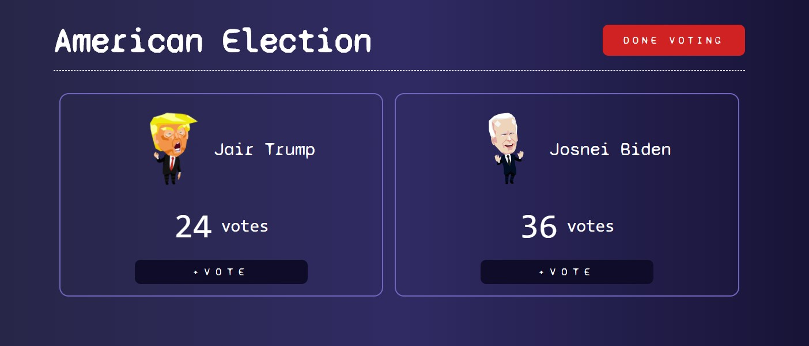

<h1 align="center">
  🤪 American Election
</h1>

<p align="center">
  <a href="#trophy-lessons-learned">Lessons Learned</a>&nbsp;&nbsp;&nbsp;|&nbsp;&nbsp;&nbsp;
  <a href="#rocket-technologies--resources">Technologies</a>&nbsp;&nbsp;&nbsp;|&nbsp;&nbsp;&nbsp;
  <a href="#hammer-setting-up-the-environment">Environment Setup</a>
</p>

<p align="center">
  

  

  

  

  
</p>



Application developed as an assignment to college, subject Development for Mobile Devices, at UFPR, in order to learn building React applications firstly on web, so we can move on to React Native. The project seeks to apply knowledge in functional components, components communication (via *props* and *lifting state up*) and state management with Hooks.

[Check out the application running!](https://american-election.vercel.app/)

The proposal was to build a simple **votes counter system** with hard-coded candidates and, after finishing the input, display the rank of the most voted ones. A good-looking app may earn extra points 😍.

## :trophy: Lessons Learned

- Functional components;
- React Hooks (and custom Hooks);
- Synchronized state update ([see nice article](https://medium.com/javascript-in-plain-english/commons-mistakes-with-react-usestate-hook-and-how-to-prevent-them-43c811ca7451));

## :rocket: Technologies & Resources

**Frontend:**
- React.js 17
- Create-React-App
- Animate.css

**Development:**
- Visual Studio Code
- NPM routines

## :hammer: Setting up the Environment

Make sure to have **Node.js 10+** installed in your machine and its **npm** available in the command line, then use the following routines:

```bash
$ npm install     # download dependencies
$ npm run serve   # run development server
$ npm run build   # build files for production
```
